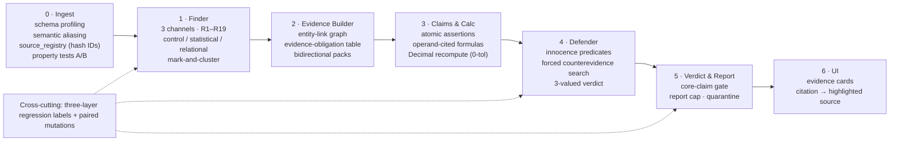

# FinanceAudit

**An auditor-facing agent that finds layered fraud in a GDPdU accounting dossier and proves every claim against the exact document, row, page and passage it rests on.**

> Cortea track — *"Follow the money. Find the fraud. Prove it."* · {Tech: Europe} × Almedia "Summer Lock-In" Hackathon, Berlin, 2026-07-18/19.

FinanceAudit ingests a ~20-file German/English company dossier (Microsoft Dynamics 365 GDPdU/GoBD export plus its accompanying PDFs, DOCX, CSV and XLSX), and surfaces both surface-level inconsistencies and deep manipulations that only appear when documents are cross-linked. Its guiding principle is **"no number without a source"**: every asserted euro amount is recomputed in code from operands that each carry a resolvable citation, and every finding links back to a highlighted cell or PDF passage in an interactive evidence-card UI. The architecture deliberately splits the work — **deterministic code computes and quantifies; the LLM only maps semantics, adjudicates within a narrowed candidate set, and narrates** — so that no arithmetic and no accusation ever originates from a language model.

---

## Table of contents

- [What it does](#what-it-does)
- [Architecture overview](#architecture-overview)
- [Quick start](#quick-start)
- [Running on a NEW dossier](#running-on-a-new-dossier)
- [Results (practice-dossier regression)](#results-practice-dossier-regression)
- [OpenAI usage](#openai-usage)
- [Anti-hallucination design](#anti-hallucination-design)
- [Repository map](#repository-map)
- [Data policy](#data-policy)
- [Documentation & verification log](#documentation--verification-log)

---

## What it does

Given a dossier, the pipeline:

1. **Ingests and profiles** every file into a typed DuckDB database, assigning each row and document unit an immutable, hash-based `source_id`, and profiling every column to infer its *actual* semantic role (never trusting a declared column name blindly — see the [semantic-aliasing story](docs/ARCHITECTURE.md#the-p0-semantic-aliasing-story)).
2. **Runs 19 deterministic finder rules (R1–R19)** across three channels — control rules, statistical anomalies, relational-integrity checks — that emit neutral, clustered candidate signals.
3. **Builds bidirectional evidence packs** (an entity-link graph plus a typed evidence-obligation table) so that both the incriminating and the exculpatory evidence for a cluster are on the table before any judgment is formed.
4. **Decomposes each finding into atomic claims**, where every monetary claim is a formula over cited operands, **recomputed with Python `Decimal` at 0 tolerance** for ledger-to-ledger checks.
5. **Runs an independent defense pass**: per fraud scheme it enumerates innocence predicates and searches the dossier for counterevidence, producing a three-valued verdict (`supported` / `contradicted` / `unverifiable`).
6. **Gates the verdict**: a finding is only reported when every *core* claim is supported, its amounts recompute, and no direct counterevidence exists; everything else becomes a neutral observation, a PBC request, or is quarantined — never silently discarded.
7. **Serves an evidence-card UI** where each finding shows its assertion tree, formula + recompute, defense log and denominators, and every citation chip opens the highlighted source cell or PDF page.

The practice company is **Muster Verpackungen GmbH** (FY2025, revenue €55.4M), whose dossier contains four seeded fraud patterns (vendor-control anomaly, repair-as-capitalization, year-end cut-off, below-threshold payment splitting) and seven decoys designed to punish over-reporting.

## Architecture overview



Each stage is an idempotent CLI writing a JSON/DuckDB artifact that the next stage consumes; the boundary contracts are frozen in [`docs/CONTRACTS.md`](docs/CONTRACTS.md). A deeper per-stage walkthrough — artifacts, the `finding.json` schema with a real example, the citation model, the semantic-aliasing showcase, property tests, defense predicates and eval methodology — is in [`docs/ARCHITECTURE.md`](docs/ARCHITECTURE.md).

## Quick start

Python 3.9+ (developed on `/usr/bin/python3`). No build step; everything runs offline.

```bash
# 1. environment
python3 -m venv .venv && source .venv/bin/activate
pip install -r requirements.txt

# 2. place the dossier (it is NOT in the repo — see Data policy)
#    unpack it so that data/practice/ contains Sachkonten/, Debitoren/,
#    Kreditoren/, AV/, Steuercodes/ and Begleitdokumente/
mkdir -p data/practice && cp -R "/path/to/Uebungsdaten Muster Verpackungen/." data/practice/

# 3. run the full pipeline (ingest → finder → evidence → claims → defense → verdict → eval)
python3 scripts/run_pipeline.py            # writes everything under build/

# 4. open the evidence-card UI  →  http://127.0.0.1:8642
./scripts/serve_ui.sh

# 5. re-run the regression eval on its own
python3 -m evalx.run
```

`scripts/run_pipeline.py` prints a per-stage banner and timing and stops on any nonzero exit (an A-class property-test failure or an unresolvable-citation eval gate). Individual stages can also be run one at a time — see [`docs/CONTRACTS.md` §1](docs/CONTRACTS.md).

## Running on a NEW dossier

The pipeline is not wired to the practice answers; rules key off *field roles* (assigned by column profiling), not hard-coded column names, and thresholds fall back gracefully when no audit plan is present. To run on a fresh dossier:

```bash
# option A: drop it into a named folder and point the env vars at it
mkdir -p data/finals && cp -R "/path/to/new dossier/." data/finals/
FA_DATA_DIR=data/finals FA_BUILD_DIR=build_finals \
    python3 scripts/run_pipeline.py --data data/finals --build build_finals

# serve that build
FA_BUILD_DIR=build_finals FA_DATA_DIR=data/finals ./scripts/serve_ui.sh
```

- `FA_DATA_DIR` / `FA_BUILD_DIR` (read by `ui/server.py`) let the UI point at any dossier + build directory; `--data` / `--build` do the same for the pipeline.
- If the new dossier ships an audit-planning document, control thresholds (dual-approval limit, materiality, lock date) are **extracted with citations**; otherwise the finder falls back to configured defaults and finally to threshold-free, distribution-relative rules (see [`docs/ARCHITECTURE.md` §threshold fallback](docs/ARCHITECTURE.md#threshold-three-level-fallback)).
- Structural differences (renamed/re-typed columns, missing tables) are absorbed by per-file schema adapters and the semantic-alias layer; declared-vs-observed conflicts are recorded in the manifest rather than silently trusted.

## Results (practice-dossier regression)

The numbers below are **local, reproducible regression results on the practice dossier only** (`build/eval_report.json`, generated with `llm_used: false` — i.e. the deterministic path, no API key at build time). They are *not* a claim about performance on the unseen jury dossier, and no external-paper benchmark number is reported as a product metric.

| Metric | Result |
|---|---|
| Target fraud recall (finding-level) | **4 / 4** — F1 net €248,000.00 (exact) · F2 €150,800.00 (exact) · F3 range €105,500–192,000 with required "potential unmatched liability" phrase · F4 €39,040.00 (exact) |
| Candidate recall (finder-level) | 4 / 4 |
| Decoy false positives | **0** (D5 entity conflict surfaced as a *neutral observation*, as intended) |
| Citation resolvability | **230 / 230 = 100%** (every citation re-opened via the source registry); candidate operands 435 / 435 = 100% |
| Dispositions | report **5** · observation **36** · rejected **0** · quarantine **0** (41 findings, 47 candidates) |
| Ingest coverage | 28 / 28 files parsed complete, 32,940 / 32,940 units (100%) |
| Ledger integrity | GL nets to €0.00; 8,391 entry groups all balanced; sub-ledger↔GL↔OP↔trial-balance tie-outs at 0 deviation; 8/8 SHA-256 export hashes match |
| Pipeline runtime | ~5s warm; ~14s cold from a fresh clone + venv (verified end-to-end, `BUILD_LOG.md` M2) |

Reproduce with `python3 scripts/run_pipeline.py` (which ends with the `EVAL` stage) or `python3 -m evalx.run` against an existing `build/`.

## OpenAI usage

The mandatory partner technology is **OpenAI**, used only where language understanding — not computation — is required, always through **Structured Outputs (`json_schema`, `strict`)**:

- **Mechanism classification & assertion decomposition** (claims stage): map a candidate cluster to a fraud scheme within a *closed set* and split a finding into atomic, typed claims.
- **Defense narration** (defender stage): phrase the innocence-predicate results; the retrieval itself is deterministic joins.
- LLM candidate *links* over unstructured text (entity aliases, contract references) only ever become "pending" suggestions and must be confirmed by identifier match before they touch the fact graph.

Enablement and fallback:

- Set `OPENAI_API_KEY` to enable the LLM layers. When it is **absent, every call site runs a deterministic fallback and stamps `llm_used: false`** in its output — the entire pipeline, the eval and the UI run end-to-end with no key.
- **Exercised end-to-end (2026-07-18):** with a key set, the `ENRICH` stage drafts audit working-paper narratives + suggested next steps per finding via **Structured Outputs (strict JSON schema)** — models configurable via `FA_MODEL_REASONING`/`FA_MODEL_FAST` in `.env` (current config: `gpt-5.6-sol` for every call; the 5.6 preview family intermittently 401s under capacity pressure, absorbed by client-side retries) — and finder rule R9 rates rare account co-occurrences in a constrained three-way choice. Guardrails: the LLM never computes amounts, selects evidence or touches the verdict gate; outputs are post-filtered (any digit token not present in the finding's own facts ⇒ rejected; fraud wording without intent indicators ⇒ rejected) and rejected drafts fall back to the deterministic text. Latest run (gpt-5.6-sol): 24/41 narratives accepted, 0 wording violations, eval gates unchanged (4/4 recall, 0 decoy FPs, 230/230 citations).
- **Honesty note:** all *detection and quantification* results are from the deterministic path by design; the LLM layer is presentation/adjudication-support only, and every finding shows whether its narrative is AI-drafted.

## Anti-hallucination design

The system is built so that a hallucinated number or accusation has no path into a reported finding:

- **Operand-must-be-cited** — a euro value can only enter a formula if it is an already-supported claim or a resolvable `source_id`; unreferenced numbers cannot be summed.
- **No LLM arithmetic** — all amounts are recomputed in Python `Decimal` (0 tolerance for ledger-to-ledger, explicit tolerance tables only for prose/tax/rounding); the model never outputs a computed figure or a PDF coordinate.
- **Three-valued verdicts** — `supported` / `contradicted` / `unverifiable`; "unverifiable" moves a claim to the *needs-material* queue instead of being dropped or asserted.
- **Independent defense pass** — a separate context enumerates innocence predicates and searches for counterevidence before anything is reported; the log reads *"N innocence checks run, no counterevidence found"*, never *"defense failed ⇒ guilty."*
- **Quarantine, not discard** — schema/format failures are quarantined with their logs and counted in the UI; there is no silent drop and no automatic rewrite of factual content.
- **Core-claim gate & report cap** — a finding reports only if all core claims are supported and amounts recompute; the top-k cap is a ceiling, not a quota (zero qualifying findings is a valid outcome).
- **Language gate for "missing" evidence** — the system says "not found in the provided and parsed materials" unless a file's declared population scope actually covers that evidence type; and fraud wording is used only with intent indicators (control bypass, contradictory evidence), never from an anomaly score alone.

## Repository map

```
financeaudit/
  core/        shared config & helpers (read-only for stage agents)
  ingest/      GDPdU + sidecar parsers, column profiler, property tests   → build/audit.duckdb, manifest.json, profiles.json, property_tests.json
  finder/      rules_control · rules_statistical · rules_relational · thresholds  → build/candidates.json, finder_meta.json, thresholds.json
  evidence/    entity-link graph + bidirectional evidence packs           → build/evidence_packs.json
  claims/      atomic-claim engine + Decimal recompute                    → build/findings_draft.json
  defense/     innocence predicates + counterevidence retrieval           → build/findings_defended.json
  verdict/     core-claim gate + static HTML report                       → build/findings.json, build/report.html
ui/            FastAPI server (ui/server.py) + hand-written ES-module frontend (ui/web/) + fixtures
evalx/         three-layer regression labels, metrics runner, paired mutations  → build/eval_report.json
scripts/       run_pipeline.py (full pipeline), serve_ui.sh (UI launcher)
docs/          PLAN.md (battle plan) · CONTRACTS.md (stage contracts) · ARCHITECTURE.md · DEMO_SCRIPT.md
data/          dossiers (gitignored)          build/  pipeline outputs (gitignored)
BUILD_LOG.md   milestone + reproduction log
```

## Data policy

The dossiers under `data/` (practice **and** finals), API keys, caches and model outputs are **gitignored by default** (`.gitignore`) — the repository is public, but the audit data is not committed. Place the dossier under `data/<name>/` after cloning; the README quick-start is a one-command reproduction from there.

## Documentation & verification log

- [`docs/PLAN.md`](docs/PLAN.md) — full battle plan (architecture rationale, rule catalog, eval methodology, references).
- [`docs/CONTRACTS.md`](docs/CONTRACTS.md) — frozen inter-stage contracts (paths, DuckDB schema, `finding.json`).
- [`docs/ARCHITECTURE.md`](docs/ARCHITECTURE.md) — deep technical documentation for jury evaluation.
- [`docs/DEMO_SCRIPT.md`](docs/DEMO_SCRIPT.md) — the timed 2-minute video script.
- **Verification log:** [`BUILD_LOG.md`](BUILD_LOG.md) records each milestone, the cross-module fixes behind the current eval, and the from-zero (fresh clone + venv) reproduction test.

> **Rules re-verification (per PLAN §1.1):** _[TO FILL after the final Discord announcement — submission deadline, partner-technology requirement and deliverable format re-checked at YYYY-MM-DD HH:MM CEST.]_
